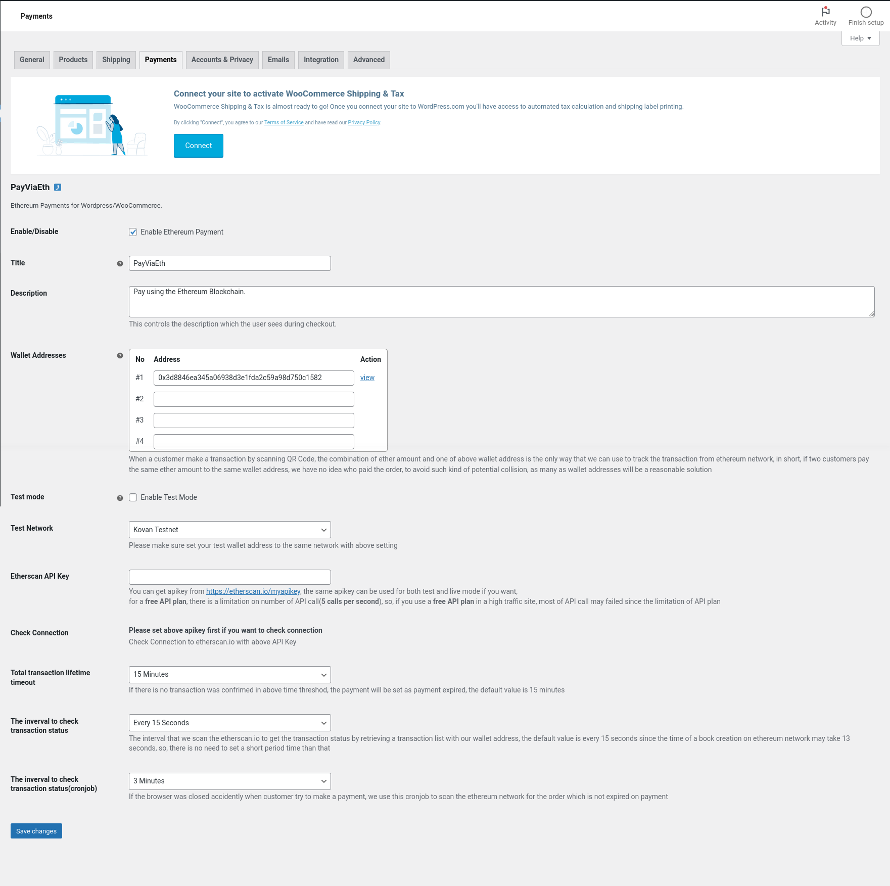

Settings
********

Information covering the PayViaEth settings.

1. Enable/Disable: This Enables or Disables the plugin's payment gateway.

2. Title: The title of the payment gateway. What the customer sees at checkout.

3. Description: The description of the payment gateway. What the customer sees at checkout.

4. Wallet Addresses: The list of wallet addresses for the store to use.

5. Test Mode: Test mode boolean

6. Test Network: Test Network

7. Etherscan API key: Experimental** Will be removed at some point and replaced with generic eth node.

8. Check Connection: Experimental** Displays in the afirmative if the etherscan API connects correctly.

9. Total Transaction Lifetime: Experimental**

10. The interval to check transaction status: Experimental**

11. The interval to check transaction status (cronjob): Experimental**
